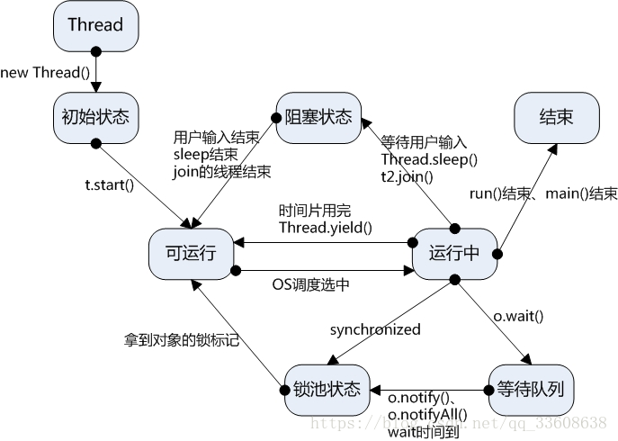

# 进程与线程基础
## 什么是进程？
&nbsp;&nbsp;&nbsp;&nbsp;进程（Process）是计算机中的程序关于某数据集合上的一次运行活动，是系统进行资源分配和调度的基本单位，是操作系统结构的基础。在早期面向进程设计的计算机结构中，进程是程序的基本执行实体；在当代面向线程设计的计算机结构中，进程是线程的容器。程序是指令、数据及其组织形式的描述，进程是程序的实体。——《百度百科》  
&nbsp;&nbsp;&nbsp;&nbsp;以上是《百度百科》对进程的解释，在我们初读的时候会觉得比较抽象，我们换个方式来看它。打开我们windows系统的任务管理器，你会看到很多软件的任务，<b>我们可以将每个任务都理解为是一条进程</b>。这些进程就是受操作系统管理的基本运行单元。 
#### 那么进程是由什么组成的呢？ 
&nbsp;&nbsp;&nbsp;&nbsp;当前有一个进程是你的"word"，另一个进程是"QQ"，你可以同时开着他们而不会影响你操作系统的正常使用。这个过程中，你的"word"可能在进行" 文字编辑"和"拼写检查"等等操作，这些操作就是进程中的<b>线程</b>。也就是说，线程是进程中的实体，进程之间是分隔的，而同个进程中的多个线程是共享相同的内存地址空间的。我们可以这样来解释，进程是一条多车道的高速，而它里面的线程就是车道上的车，各个车（线程）共用车道，他们之间有的快，有的慢，有的车会一起“出发”（就绪状态），有的车会在路上堵车（堵塞状态），更多的车都在正常前进（运行状态）。下面这张线程状态图就很好展现了各个线程状态的前后关系。 

&nbsp;&nbsp;&nbsp;&nbsp;既然线程有那么多的状态和共享同一个进程中的内存，为了不使线程之间发生混乱，我们应当使用加锁的方式来管理我们的线程。
#### 线程一般存在哪些锁呢？ 
- 公平锁/非公平锁
- 可重入锁
- 独享锁/共享锁
- 互斥锁/读写锁
- 乐观锁/悲观锁
- 分段锁
- 偏向锁/轻量级锁/重量级锁
- 自旋锁

&nbsp;&nbsp;&nbsp;&nbsp;关于这些锁的使用，我们会在后面的章节进行详细的介绍。最终我们可以得出一个结论，进程和线程都是我们使用处理器工作的一个状态描述，只不过是时间状态的颗粒度不同。
##### 参考链接
- [Java线程中wait状态和block状态的区别?](https://www.zhihu.com/question/27654579)
- [进程——百度百科](https://baike.baidu.com/item/%E8%BF%9B%E7%A8%8B/382503?fr=aladdin)
- [Java多线程中锁的理解与使用](https://blog.csdn.net/tyyj90/article/details/78236053)