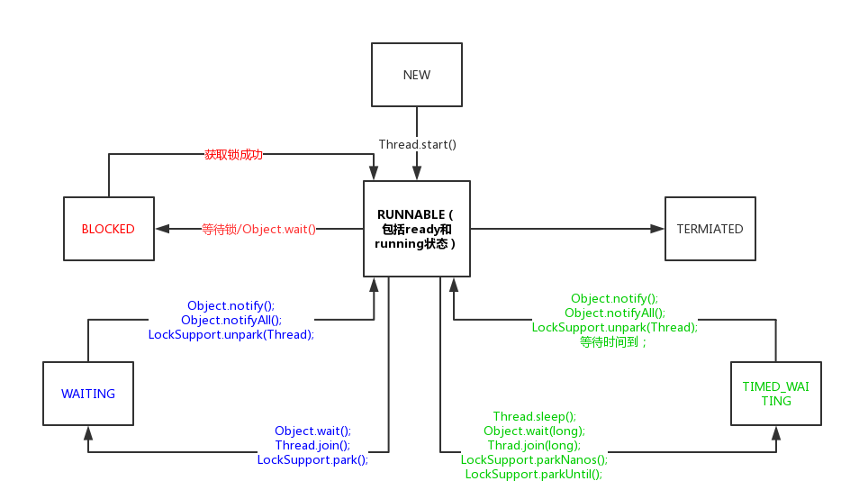

# 大纲
- Java线程的6个状态
    - NEW 
    - RUNNABLE
        - 传统进程的状态（new,ready,running,waiting...）
        - Thread的RUNNABLE状态（包含了传统进程的ready和running状态）
    - BLOCKED
    - WAITING
        - 几个使线程进入WAITING状态的方法(Object.wait(), Thread.join(), LockSupport.park())
    - TIMED_WAITING
        - 几个使线程进入TIMED_WAITING的方法:Thread.sleep(long millis),Object.wait(long timeout), Thread.join(long millis),LockSupport.parkNanos(long nanos),LockSupport.parkUntil(long deadline)
        - BLOCKED,WAITING,TIMED_WAITING的区别
    - TERMINATED

- 线程状态的转换
    - 转换图    
    - 状态的转换说明，主要方法介绍
    
***

## Java线程的6个状态
```java
public enum State {
        NEW,
        RUNNABLE,
        BLOCKED,
        WAITING,
        TIMED_WAITING,
        TERMINATED;
    }
```
### NEW
> 处于NEW状态的线程此时尚未启动。这里的尚未启动指的是还没调用Thread.start()方法。  

```java
    private void testStateNew() {
        Thread thread = new Thread(new Runnable() {
            @Override
            public void run() {
                
            }
        });
        System.out.println(thread.getState()); // 输出 NEW 
    }
```
从上面可以看出，只是创建了线程而并没有调用start()方法，此时线程处于NEW状态。

### RUNNABLE
> 运行中的线程状态。处于RUNNABLE状态的线程再Java虚拟机中运行，也有可能在等待其他系统资源（比如IO）。

#### 系统进程状态
我们先来看看系统**进程（Process）**状态转换图：  
  
进程主要有以下三个状态：
- 就绪状态(ready)：进程正在等待使用CPU，经调度程序调用之后可进入running状态。
- 执行状态(running)：进程正在使用CPU。
- 等待状态(waiting): 进程经过等待事件的调用或者正在等待其他资源（如IO）。  

#### 线程的RUNNABLE状态
看了进程的几个状态之后我们来看看Thread源码里对RUNNABLE状态的定义：
```text
/**
 * Thread state for a runnable thread.  A thread in the runnable
 * state is executing in the Java virtual machine but it may
 * be waiting for other resources from the operating system
 * such as processor.
 */
```
源码里说处于RUNNABLE状态的线程可能在Java虚拟机内执行，也有可能在等待操作系统的资源。我们对比着系统进程的几个状态可以知道：
> Java线程的**RUNNABLE**状态其实是包括了传统操作系统进程的**ready**和**running**两个状态的。

### BLOCKED
> 阻塞状态。处于BLOCKED状态的线程正等待锁的释放以进入同步代码块或方法。

我们用BLOCKED状态举个生活中的例子：
> 假如今天你下班后准备去食堂吃饭。你来到食堂仅有的一个窗口，发现前面已经有个人在窗口前了，此时你必须得等前面的人从窗口离开才行。  
假设你是线程t1，你前面的那个人是线程t2。此时t2占有了锁（食堂唯一的窗口），t1正在等待锁的释放，所以此时t1就处于BLOCKED状态。

### WAITING
> 等待状态。处于等待状态的线程变成RUNNABLE状态需要其他线程唤醒。

调用如下3个方法会使线程进入等待状态：
- Object.wait(): 使当前线程处于等待状态直到另一个线程唤醒它。
- Thread.join(): 等待线程执行完毕，等价于join(0)。
- LockSupport.park(): 除非获得调用许可，否则禁用当前线程进行线程调度。  
 
我们延续上面的例子继续解释一下WAITING状态：  
> 你等了好几分钟现在终于轮到你了，突然你们有一个“不懂事”的经理突然来了。你看到他你就有一种不祥的预感，果然，他是来找你的。他把你拉到一旁叫你待会儿再吃饭，说他下午要去作报告，赶紧来找你了解一下项目的情况。你心里虽然有一万个不愿意但是你还是从食堂窗口走开了。  
此时，假设你还是线程t1，你的经理是线程t2。虽然你此时都占有锁（窗口）了，“不速之客”来了你还是得释放掉锁。此时线程t1的状态就是WAITING。要是没有其他人将你或者你的经理拉走（notify、notifyAll..），可以说你和你的经理只有耗在这儿了。

### TIMED_WAITING
> 超时等待状态。线程等待一个具体的时间，时间到后会被自动唤醒。

调用如下方法会使线程进入超时等待状态：
- Thread.sleep(long millis): 使当前线程睡眠指定时间。
- Object.wait(long timeout)： 线程休眠指定时间，等待期间可以通过notify()/notifyAll()唤醒。
- Thread.join(long millis)：等待当前线程最多执行millis毫秒，如果millis为0，则会一直执行。
- LockSupport.parkNanos(long nanos)： 除非获得调用许可，否则禁用当前线程进行线程调度指定时间。
- LockSupport.parkUntil(long deadline): 同上，也是禁止线程进行调度指定时间。

来，我们继续延续上面的例子来解释一下TIMED_WATING状态：  
> 到了第二天中午，又到了饭点，你还是到了窗口前。突然间想起你的同事叫你等他一起，他说让你等他十分钟他改个bug。好吧，你说那你就等等吧，你就离开了窗口。很快十分钟过去了，你见他还没来，你想都等了这么久了还不来，那你还是先去吃饭好了。  
这时你还是线程t1，你改bug的同事是线程t2。t2让t1等待了指定时间，t1还释放了锁。此时t1就处于TIMED_WATING状态。

### TERMINATED
> 终止状态。此时线程已执行完毕。

## 线程状态的转换
根据上面关于线程状态的介绍我们可以得到下面的**线程状态转换图**：


### BLOCKED与RUNNABLE状态的转换
我们在上面说到：处于BLOCKED状态的线程是因为在等待锁的释放。假如这里有两个线程a和b，a线程提前获得了锁并且暂未释放锁，此时b就处于BLOCKED状态。我们先来看一个例子：
```java
    @Test
    public void blockedTest() {

        Thread a = new Thread(new Runnable() {
            @Override
            public void run() {
                testMethod();
            }
        }, "a");
        Thread b = new Thread(new Runnable() {
            @Override
            public void run() {
                testMethod();
            }
        }, "b");

        a.start();
        b.start();
        System.out.println(a.getName() + ":" + a.getState()); // 输出？
        System.out.println(b.getName() + ":" + b.getState()); // 输出？
    }

    private synchronized void testMethod() {
        try {
            Thread.sleep(2000L);
        } catch (InterruptedException e) {
            e.printStackTrace();
        }
    }
```
初看之下，大家可能会觉得线程a会先调用同步方法，同步方法内又调用了Thread.sleep()方法，必然会输出TIMED_WAITING，而线程b因为等待线程a释放锁所以必然会输出BLOCKED。其实不然，有两点需要值得大家注意，一是**在测试方法blockedTest()内还有一个main线程**，二是**启动线程后执行run方法还是需要消耗一定时间的**。不打断点的情况下，上面代码中都应该输出**RUNNABLE**。
> 测试方法的main线程只保证了a，b两个线程调用start()方法（转化为RUNNABLE状态），还没等两个线程真正开始争夺锁，就已经打印此时两个线程的状态（RUNNABLE）了。 

这时你可能又会问了，要是我想要打印储BLOCKED状态我该怎么处理呢？其实就处理下测试方法里的main线程就可以了，你让它“休息一会儿”，打断点或者调用Thread.sleep方法就行。这里需要注意的是main线程休息的时间，要保证在线程争夺锁的时间内，不要等到前一个线程锁都释放了你再去争夺锁，此时还是得不到BLOCKED状态的。  
我们把上面的测试方法blockedTest()改动一下：
```java
    public void blockedTest() throws InterruptedException {
        ······
        a.start();
        Thread.sleep(1000L); // 需要注意这里main线程休眠了1000毫秒，而testMethod()里执行线程休眠了2000毫秒
        b.start();
        System.out.println(a.getName() + ":" + a.getState()); // 输出？
        System.out.println(b.getName() + ":" + b.getState()); // 输出？
    }
```
在这个例子中，由于main线程休眠，所以线程a的run()方法跟着执行，线程b再接着执行。在线程a执行run()调用testMethod()之后，线程a休眠了2s（注意这里是没有释放锁的），main线程休眠完毕，接着b线程执行的时候是争夺不到锁的，所以这里输出：
```text
a:TIMED_WAITING
b:BLOCKED
```

### WAITING状态与RUNNABLE状态的转换
根据转换图我们知道有3个方法可以使线程从RUNNABLE状态转为WAITING状态。我们主要介绍下**Object.wait()**和**Thread.join()**。
#### Object.wait()
> 调用wait()方法前线程必须持有对象的锁。线程调用wait()方法时，会释放当前的锁，直到有其他线程调用notify()/notifyAll()方法唤醒等待锁的线程。需要注意的是，其他线程调用notify()方法只会唤醒单个等待锁的线程，如有有多个线程都在等待这个锁的话不一定会唤醒到之前调用wait()方法的线程；同样，调用notifyAll()方法唤醒所有等待锁的线程之后，也不一定会马上把时间片分给刚才放弃锁的那个线程，具体要看系统的调度。

#### Thread.join()
> 调用join()方法会一直等待当前线程执行完毕（转换为TERMINATED状态）。

我们再把上面的例子线程启动那里改变一下：
```java
    public void blockedTest() {
        ······
        a.start();
        a.join();
        b.start();
        System.out.println(a.getName() + ":" + a.getState()); // 输出 TERMINATED
        System.out.println(b.getName() + ":" + b.getState());
    }

```
要是没有调用join方法，main线程不管a线程是否执行完毕都会继续往下走。a线程启动之后马上调用了join方法，这里main线程就会等到a线程执行完毕，所以这里a线程打印的状态固定是**TERMIATED**。至于b线程的状态，有可能打印RUNNABLE（尚未进入同步方法），也有可能打印TIMED_WAITING（进入了同步方法）。

### TIMED_WAITING与RUNNABLE状态转换
> TIMED_WAITING与WAITING状态类似，只是TIMED_WAITING状态等待的时间是指定的。

#### Thread.sleep(long)
> 使当前线程睡眠指定时间。需要注意这里的“睡眠”只是暂时使线程停止执行，并不会释放锁。时间到后，线程会重新进入RUNNABLE状态。

#### Object.wait(long)
> wait(long)方法使线程进入TIMED_WAITING状态。这里的wait(long)方法与无参方法wait()相同的地方是，都可以通过其他线程调用notify()或notifyAll()方法来唤醒；不同的地方是，有参方法wait(long)就算其他线程不来唤醒它，经过指定时间long之后它会自动唤醒。

#### Thread.join(long)
> join(long)使当前线程执行指定时间，并且使线程进入TIMED_WAITING状态。
我们再来改一改刚才的示例:
```java
    public void blockedTest() {
        ······
        a.start();
        a.join(1000L);
        b.start();
        System.out.println(a.getName() + ":" + a.getState()); // 输出 TIEMD_WAITING
        System.out.println(b.getName() + ":" + b.getState());
    }
```
这里调用a.join(1000L)，因为是指定了具体a线程执行的时间的，并且执行时间是小于a线程sleep的时间，所以a线程状态输出TIMED_WAITING。同样，b线程状态不固定（RUNNABLE或BLOCKED）。


# 参考
- 源码
- [深入Thread.sleep](https://blog.csdn.net/pangpang123654/article/details/77006244)
- [不可不说的Java“锁”事](https://tech.meituan.com/Java_Lock.html)
- [Java线程状态分析](https://fangjian0423.github.io/2016/06/04/java-thread-state/)