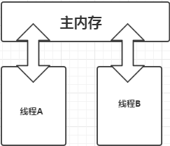

## happens-before和重排序回顾
 上一节2-2中我们已经学习了happens-before和重排序，在上一节中我们了解到：
* **内存可见性**：是由于JMM规定了所有的变量都存储在主内存中(虚拟机内存的一部分)。每条线程还有自己的工作内存,线程的工作内存中保存了被该线程使用到的变量的主内存副本拷贝，线程对变量的所有操作（读取、赋值等）都必须在工作内存中进行，而不能直接读写主内存中的变量。**不同的线程之间也无法直接访问对方工作内存中的变量**。那么如何实现内存的可见性?即当写线程改写了共享变量的时候，而其他线程能够感知到变量改变了，同时在读取这个共享变量的时候，它是写线程写入的最新值。**总结起来，是指线程之间的可见性，当一个线程修改了共享变量时，另一个线程可以读取到这个修改后的值**
---

* **JMM(Java内存模型)之happens-before规则**：是Java内存模型中定义的两项操作之间的偏序关系，其中主要包括：包括程序次序规则、管程锁定规则、volatile变量规则、线程终止规则、线程中断规则、对象终结规则、传递性。对于程序员关注最多的是：程序次序规则、管程锁定规则、volatile变量规则、传递性如果相关操作满足上述规则，则不需要任何同步器协助即可保证操作的有序性，如果不在上述规则或者无法从上述规则中推导出来，那么就没有顺序性的保障。
---
* **JMM(java内存模型)之as-if-serial语义**：不管怎么重排序（编译器和处理器为了提高并行度），（单线程）程序的执行结果不会改变。编译器、runtime和处理器都必须遵守as-if-serial语义。为了遵守as-if-serial语义，**编译器和处理器不会对存在数据依赖关系的操作做重排序，因为这种重排序会改变执行结果。**
---
* **重排序**：通常是编译器或运行时环境为了优化程序性能而采取的对指令进行重新排序执行的一种手段。包括：编译器优化的重排序、指令级并行的重排序、内存系统的重排序
---

## volatile 实现原理
1.**解决可见性**：在读操作时，JMM会把工作内存当中的变量设置为无效，要求线程直接从主内存当中读取；写操作时，会把修改过的变量更新到主内存中去，其他线程就会拿到主内存当中地最新值。因此可以看做是读线程与写线程都在主内存中操作。如下图


2.**解决禁止指令重排序**：有volatile修饰的变量，赋值后多执行了一个“load addl $0x0, (%esp)”操作，这个操作相当于一个**内存屏障**（指令重排序时不能把后面的指令重排序到内存屏障之前的位置)。重排序有三种，编译器重排序会按JMM的规范严格进行，换言之编译器重排序一般不会对程序的正确逻辑造成影响,第二、三步属于处理器重排序，处理器重排序JMM就不好管了，怎么办呢？它会要求java编译器在生成指令时加入内存屏障，内存屏障是什么？你可以理解为一个不透风的保护罩，把不能重排序的java指令保护起来，那么处理器在遇到内存屏障保护的指令时就不会对它进行重排序了。关于在哪些地方该加入内存屏障，内存屏障有哪些种类，各有什么作用，这些知识点这里就不再阐述了。可以参考JVM规范相关资料。
java中提供的内存屏障机制有四种：LoadLoad,StoreStore,LoadStore,StoreLoad
>**LoadLoad屏障**：对于这样的语句Load1; LoadLoad; Load2，在Load2及后续读取操作要读取的数据被访问前，保证Load1要读取的数据被读取完毕。
**StoreStore屏障**：对于这样的语句Store1; StoreStore; Store2，在Store2及后续写入操作执行前，保证Store1的写入操作对其它处理器可见。
**LoadStore屏障**：对于这样的语句Load1; LoadStore; Store2，在Store2及后续写入操作被刷出前，保证Load1要读取的数据被读取完毕。
**StoreLoad屏障**：对于这样的语句Store1; StoreLoad; Load2，在Load2及后续所有读取操作执行前，保证Store1的写入对所有处理器可见。它的开销是四种屏障中最大的。在大多数处理器的实现中，这个屏障是个万能屏障，兼具其它三种内存屏障的功能


## volatile 性能
volatile 的读性能消耗与普通变量几乎相同，但是写操作稍慢，因为它需要在本地代码中插入许多内存屏障指令来保证处理器不发生乱序执行。

## volatile 适用的场景
由于synchronized有一定的性能问题，而volatile关键字在某些情况下优于synchronized，但是由于volatile无法保证原子性，volatile 通常做某个操作完成、发生中断、或者状态的标志,因此在使用volatile时需要具备以下条件：
    1 对变量的写操作不依赖于当前值，或者你能确保只有单个线程更新变量的值(自增操作、自减操作)
    2 该变量不会与其他变量一起纳入不变性条件中(volatile变量不能用于约束条件中)
    3 在访问变量时不需要加锁(加锁机制既可以保证可见性又可以保证原子性，而volatile变量只能确保可见性)
    以上条件也就限制了,可以被写入volatile变量的**这些有效值独立于任何程序的状态**，包含变量的当前状态。
  
### 场景一：状态标志
实现 volatile 变量的规范使用仅仅是使用一个布尔状态标志，用于指示发生了一个重要的一次性事件，例如完成初始化或请求停机。
示例代码1：
```java
public class TestVolatile {
	public static void main(String[] args) {
		TestThread1 thread = new TestThread1();
		new Thread(thread).start();
		while(true) {
			if(thread.getFlag()) {
				System.out.println("over!!!");
				break;
			}
		}
	}
}
class TestThread1 implements Runnable{
	private  boolean flag = false; 
	@Override
	public void run() {
		try {
			Thread.sleep(200);
		} catch (Exception e) {
		}
		flag = true;
		System.out.println("flag=" + getFlag());
	}
	public boolean getFlag() {
		return flag;
	}
	
}
```
示例代码一运行了以后发现，控制台会输出flag=true后程序无法结束，问题在于主线程对于共享变量flag读取到flag = true,因此主线程就一直处于循环中

示例代码2：
```java
    public class TestVolatile {
	public static void main(String[] args) {
		TestThread1 thread = new TestThread1();
		new Thread(thread).start();
		while(true) {
			if(thread.getFlag()) {
				System.out.println("over!!!");
				break;
			}
		}
	}
}
class TestThread1 implements Runnable{
	private volatile boolean flag = false;  //使用volatile关键字修饰共享变量false,当此变量改变时其他线程会感知到其最新的值
	@Override
	public void run() {
		try {
			Thread.sleep(200);
		} catch (Exception e) {
		}
		flag = true;
		System.out.println("flag=" + getFlag());
	}
	public boolean getFlag() {
		return flag;
	}
}
```
console:
over!!!
flag=true

示例代码2运行了以后会发现输出上述内容以后就程序就停止了。这就是volatile关键字保证了共享变量的内存可见性，当thread线程改变了共享变量flag值以后，main线程会感知到，并且获取到共享变量的最新值，从而跳出循环，结束程序

### 一次性安全发布（one-time safe publication）
在缺乏同步的情况下，可能会遇到某个对象引用的更新值（由另一个线程写入）和该对象状态的旧值同时存在。
这就是造成著名的双重检查锁定（double-checked-locking）问题的根源，其中对象引用在没有同步的情况下进行读操作，产生的问题是您可能会看到一个更新的引用，但是仍然会通过该引用看到不完全构造的对象。如下面介绍的单例模式。
```java
    private volatile static Singleton instace;     
    public static Singleton getInstance(){     
        //第一次null检查       
        if(instance == null){              
            synchronized(Singleton.class) {    //1       
                //第二次null检查         
                if(instance == null){          //2    
                    instance = new Singleton();//3    
                }    
            }             
        }    
        return instance;   
    }
```

## 参考链接
* [happens-before规则和as-if-serial语义](https://blog.csdn.net/u010571316/article/details/64906481)
* [volatile关键字详解](https://blog.csdn.net/kg_2012/article/details/79059909)
* [Java可见性机制的原理](https://www.cnblogs.com/humc/p/5426351.html)
* [Volatile关键字介绍](https://blog.csdn.net/summerZBH123/article/details/80547516)
* [Java中Volatile关键字详解](https://www.cnblogs.com/zhengbin/p/5654805.html)
* [JVM(十一)Java指令重排序](https://blog.csdn.net/yjp198713/article/details/78839698)
* [深入理解JVM（二）——内存模型、可见性、指令重排序](https://www.cnblogs.com/leefreeman/p/7356030.html)
* [JMM-volatile与内存屏障](https://blog.csdn.net/hqq2023623/article/details/51013468)
* [并发关键字volatile（重排序和内存屏障）](https://www.jianshu.com/p/ef8de88b1343)

[1]:(https://github.com/RedSpider1/concurrent/tree/article-2-1-Java%E5%86%85%E5%AD%98%E6%A8%A1%E5%9E%8B-%E9%99%88sir) "2.1Java内存模型基础知识"

[2]:(https://www.cnblogs.com/ouyxy/p/7242563.html)
"volatile的适用场景"

