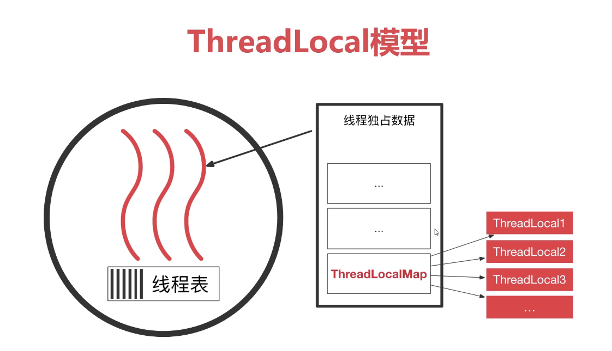
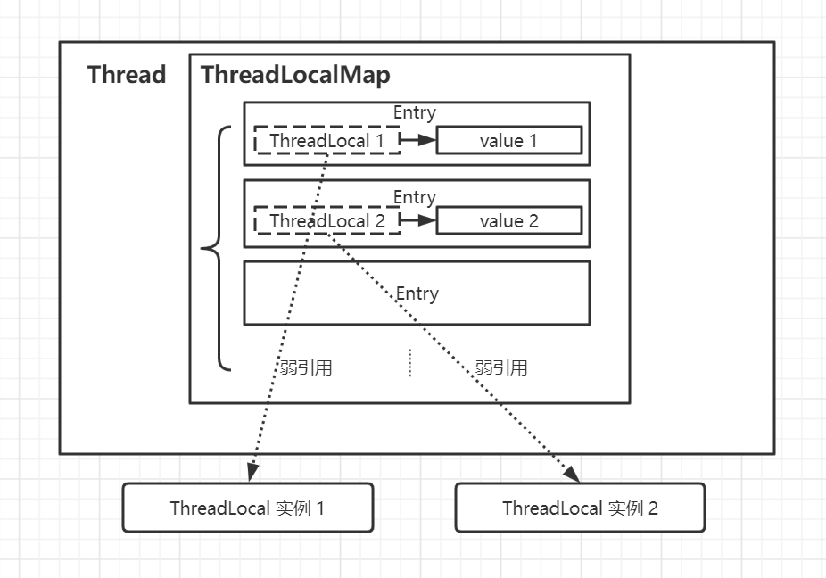
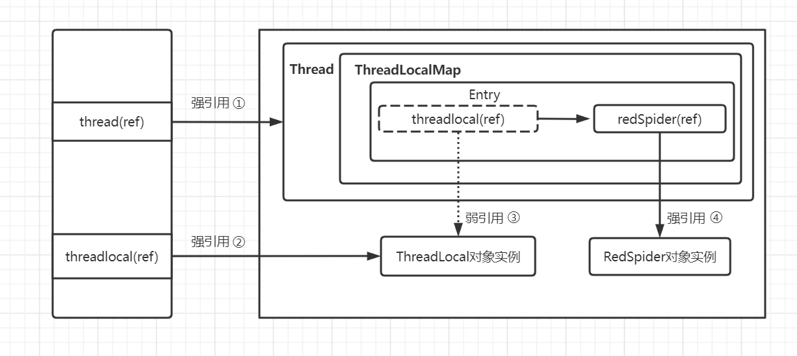
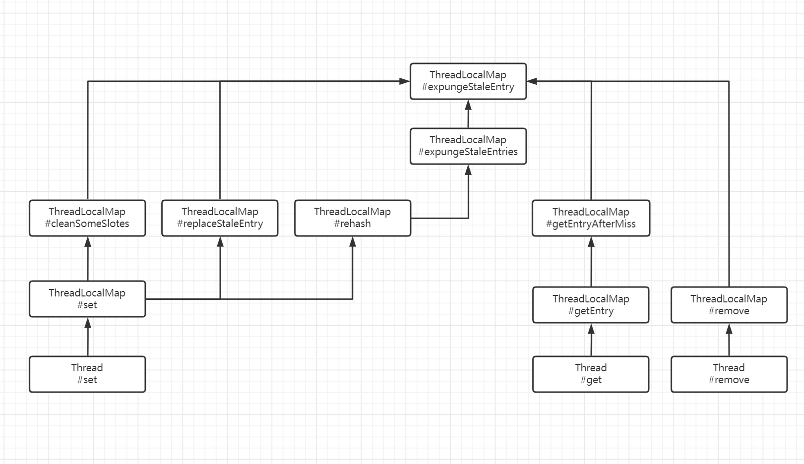
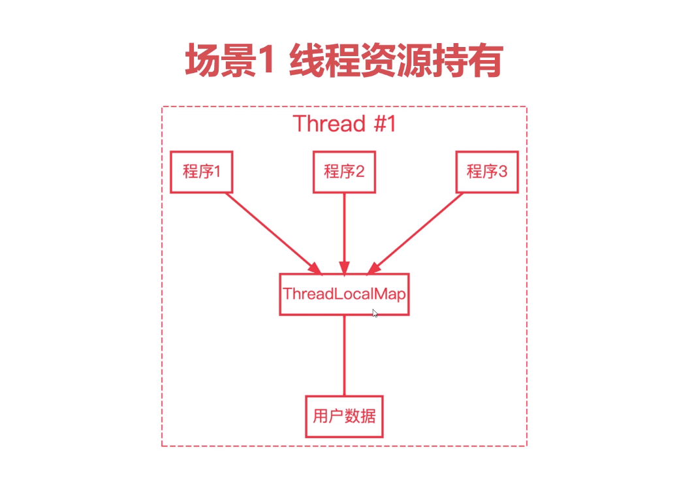
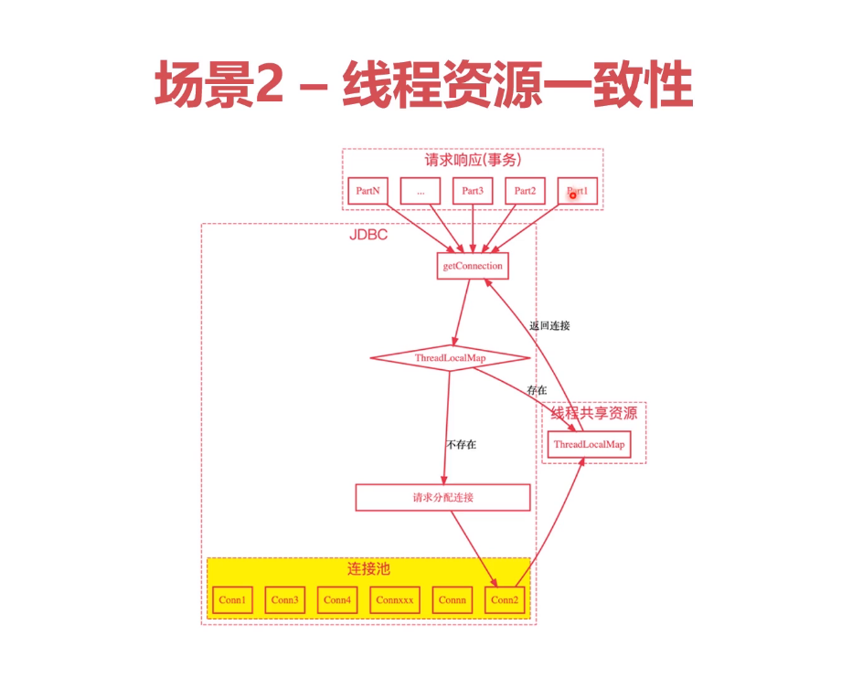
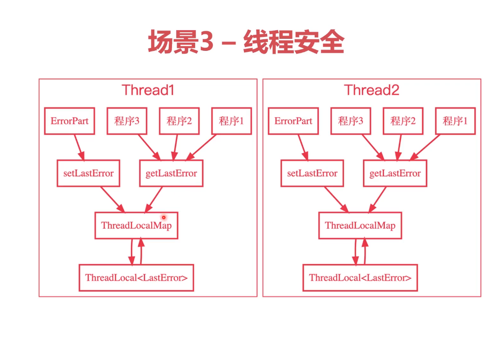
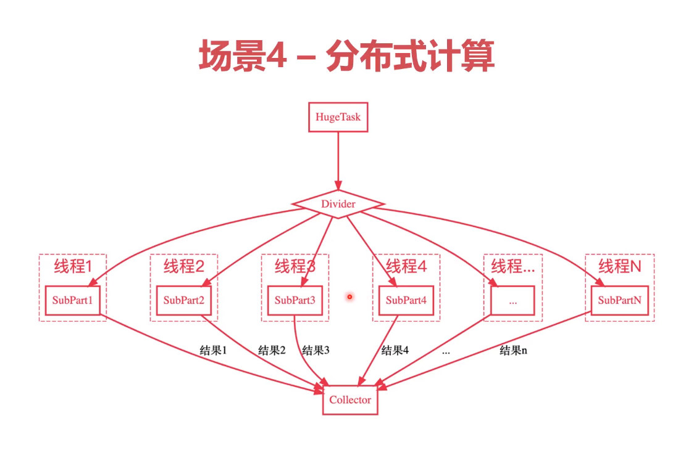

# 第二十一章 ThreadLocal

## 21.1 一致性问题
### 21.1.1 什么是一致性问题

多线程充分利用了多核CPU的威力，为我们程序提供了很高的性能。但是有时候，我们需要多个线程互相协作，这里可能就会涉及到数据一致性的问题。
数据一致性指问题的是：发生在**多个主体**对**同一份**数据无法达成**共识**。这里的多个主体，可能是多线程，也可能是多个服务器节点。
当然了，这里的“多个主体”也可以指朋友之间，夫妻之间，所谓“道不同，不相为谋”，说的就是这个理。
### 21.1.2 如何解决一致性问题

第一种是**排队**，如果两个人对一个问题的看法不一致，那就排成一队，一个人一个人去修改它，这样后面一个人总是能够得到前面一个人修改后的值，数据也就总是一致的了。我们在操作系统中的锁、互斥量、管程、屏障等等概念，都是利用了排队的思想。排队虽然能够很好的确保数据一致性，但性能非常低。

第二种是**投票**，投票的话，多个人可以同时去做一件决策，或者同时去修改数据，但最终谁修改成功，是用投票来决定的。这个方式很高效，但它也会产生很多问题，比如网络中断、欺诈等等。想要通过投票达到一致性非常复杂，往往需要严格的数学理论来证明，还需要中间有一些“信使”不断来来回回传递消息，这中间也会有一些性能的开销。
我们在分布式系统中常见的Paxos和Raft算法，就是使用投票来解决一致性问题的。感兴趣的同学可以看看这两篇关于这两个算法的文章。

- [分布式一致性算法：Raft](https://yasinshaw.com/articles/33)
- [分布式一致性算法：Paxos](https://yasinshaw.com/articles/32)

第三种是**避免**。既然保证数据一致性很难，那我能不能通 过一些手段，去避免多个线程之间产生一致性问题呢？我们程序员熟悉的git就是这个实现，大家在本地分布式修改同一个文件，最后通过版本控制和“冲突解决”去解决这个问题。
而我们今天的正题，ThreadLocal，也是使用的“避免”这种方式
## 21.2 ThreadLocal是什么
### 21.2.1 定义
ThreadLocal提供了**线程局部变量**，一个线程局部变量在多个线程中，分别有独立的值（副本）。
### 21.2.2 线程模型
下图能够比较直观地解释ThreadLocal的线程模型。


左边的黑色大圆圈代表一个进程。进程里有一个线程表，红色波浪线代表一个个线程。

对于每一个线程来说，都有自己的独占数据。这些独占数据是进程来分配的，对于Java来说，独占数据很多都是在Thread类里面分配的，而每一个线程里面都有一个 ThreadLocalMap 的对象，它本身是一个哈希表，里面会放一些线程的局部变量（红色长方形）。ThreadLocal 的核心也是这个 ThreadLocalMap。

```java
// Thread类里的变量：
ThreadLocal.ThreadLocalMap threadLocals = null;

// ThreadLocalMap的定义：
static class ThreadLocalMap {
    static class Entry extends WeakReference<ThreadLocal<?>> {
        /** The value associated with this ThreadLocal. */
        Object value;
        Entry(ThreadLocal<?> k, Object v) {
            super(k);
            value = v;
        }
    }
    // ...
}
```
### 21.2.3 基本API

- 构造函数 ThreadLocal()
- 初始化 initialValue()
- 访问器 get/set
- 回收 remove

构造函数是一个泛型的，传入的类型是你要使用的局部变量变量的类型。初始化`initialValue()` 用于如果你没有调用`set()`方法的时候，调用 `get()`方法返回的默认值。如果不重载初始化方法，会返回 **null**。
如果调用了`set()`方法，再调用`get()`方法，就不会调用`initialValue()`方法。
如果调用了`set()`，再调用`remove()`，再调用`get()`，是会调用`initialValue()`的。
```java
public static <S> ThreadLocal<S> withInitial(Supplier<? extends S> supplier) {
      return new SuppliedThreadLocal<>(supplier);
}
```
示例代码：

```java
public class ThreadLocalDemo {
    public static final ThreadLocal<String> THREAD_LOCAL = ThreadLocal.withInitial(() -> {
        System.out.println("invoke initial value");
        return "default value";
    });

    public static void main(String[] args) throws InterruptedException {
        new Thread(() ->{
            THREAD_LOCAL.set("first thread");
            System.out.println(THREAD_LOCAL.get());
        }).start();

        new Thread(() ->{
            THREAD_LOCAL.set("second thread");
            System.out.println(THREAD_LOCAL.get());
        }).start();

        new Thread(() ->{
            THREAD_LOCAL.set("third thread");
            THREAD_LOCAL.remove();
            System.out.println(THREAD_LOCAL.get());
        }).start();

        new Thread(() ->{
            System.out.println(THREAD_LOCAL.get());
        }).start();

        SECONDS.sleep(1L);
    }
}
```
输出结果:
```java
first thread
second thread
invoke initial value
default value
invoke initial value
default value
```
### 21.2.4 源码解析
#### ThreadLocalMap
ThreadLocalMap类 定义：
>ThreadLocalMap is a customized hash map suitable only for maintaining thread local values.
>No operations are exported outside of the ThreadLocal class. The class is package private to allow declaration of fields >in class Thread.  
>To help deal with very large and long-lived usages, the hash table entries useWeakReferences for keys. However, since >reference queues are not used, stale entries are guaranteed to be removed only when the table starts running out of space.

由上得知：
1. ThreadLocalMap只会被 ThreadLocal 维护
2. Entry的key使用的是弱引用(WeakReferences)

Entry 定义：
>The entries in this hash map extend WeakReference, using its main ref field as the key (which is always aThreadLocal object).  
>Note that null keys (i.e. entry.get()== null) mean that the key is no longer referenced, so the
>entry can be expunged from table.  Such entries are referred toas "stale entries" in the code that follows.

由上得知：
1. Entry的key 必须是 ThreadLocal 类型引用，并且是一个弱引用
2. 如果   entry.get()== null 意味着某Entry的key不再被引用(指向的对象已经被GC) ,所以此 entry 就可以从table 中回收，这时此 entry 在table 中被称为  stale entries

弱引用(WeakReferences) :如果某个对象**仅**剩下弱引用指向它，那么下一次GC的时候该对象就会被回收掉

```java
 	static class ThreadLocalMap {
        //ThreadLocalMap真正存数据的是Entry，且Entry的key使用的是弱引用(WeakReferences)
        static class Entry extends WeakReference<ThreadLocal<?>> {
            /** The value associated with this ThreadLocal. */
            Object value;
			
            Entry(ThreadLocal<?> k, Object v) {
                super(k);
                value = v;
            }
            
            
            // ....省略
        }
```

Thread、ThreadLocal、ThreadLocalMap、Entry 的关系 如下图所示：


####  set() 方法
set(T value) 方法:  
先拿到当前的线程，然后通过它去拿到一个Map，如果这个Map存在，就把value塞进去，否则就创建一个新的。

```java
// java.lang.ThreadLocal#set
	public void set(T value) {
    	Thread t = Thread.currentThread();	//拿到当前的线程
    	ThreadLocalMap map = getMap(t); 	//根据当前的线程拿到ThreadLocalMap
    	if (map != null) {					//如果map不为空就set value
        	map.set(this, value);
    	} else {
        	createMap(t, value);			//否则创建一个新的ThreadLocalMap，并且set value
    	}
	}
```

getMap(Thread t):  
返回当前线程的 threadLocals参数， 每个线程对应一个自己线程私有的ThreadLocalMap，它被Thread对象持有。
```java
	// java.lang.ThreadLocal#getMap
	ThreadLocalMap getMap(Thread t) {
        return t.threadLocals;
	}

	//java.lang.Thread 
	ThreadLocal.ThreadLocalMap threadLocals = null;
```

createMap(Thread t, T firstValue) 方法：
创建一个新的ThreadLocalMap对象，并赋值给当前线程对象。ThreadLocalMap的 key 是当前 ThreadLocal 对象
```java
	// java.lang.ThreadLocal#createMap  	//创建一个新的ThreadLocalMap对象，赋值给当前线程对象
	void createMap(Thread t, T firstValue) {
        //由此得知，ThreadLocalMap的 key 是当前 ThreadLocal 对象 value 是 set()方法传入的值
        t.threadLocals = new ThreadLocalMap(this, firstValue);
    }
	
```
#### get() 方法：

先通过 getMap(Thread t) 方法拿到当前线程对应的Map，然后从里面取出value。如果没有value，就调用ThreadLocal提供的初始化方法，初始化一个值。
```java
	//java.lang.ThreadLocal#get
	public T get() {
    	Thread t = Thread.currentThread(); 					//获得当前线程
    	ThreadLocalMap map = getMap(t);						//获取当前线程的ThreadLocalMap 对象
    	if (map != null) {									//当前线程的ThreadLocalMap 对象 不为空
        	ThreadLocalMap.Entry e = map.getEntry(this); 	//从当前的ThreadLocalMap 对象中取出 key为当前 ThreadLocal 对象的 Entry
       		if (e != null) {
            	@SuppressWarnings("unchecked")
            	T result = (T)e.value;						
            	return result;
        	}
    	}
    	return setInitialValue();							//当前线程的ThreadLocalMap 对象 为空返回初始值		
	}
```
setInitialValue() 方法：  
通过 initialValue() 获得初始值，将初始值赋值给当前线程的ThreadLocalMap 对象，以当前ThreadLocal对象为key ,以初始值为value。 返回该值。

```java
	//java.lang.ThreadLocal#setInitialValue
 	private T setInitialValue() {
        	T value = initialValue();
        	Thread t = Thread.currentThread();
        	ThreadLocalMap map = getMap(t);
        	if (map != null)
            	map.set(this, value);
        	else
            	createMap(t, value);
        	return value;
    	}

```

#### remove()方法

remove()方法不得不提。首先我们思考一下，既然已经有了弱引用，按理说，如果线程没有持有某个value的时候，会在GC的时候自动清理掉对应的Entry，为什么会有remove()方法存在？  
因为我们在开发一个多线程的程序时，往往会使用线程池。而线程池的功能就是线程的复用。那如果线程池和ThreadLocal在一起就可能会造成一个问题：
- job A和job B共用了同一个线程，
- job A使用完ThreadLocal，ThreadLocal里面还有job A保存的值，而这个时候可能还没有清理掉，
- job B复用线程进来了，取出来是 job A的值，可能就会造成问题。

所以在有必要的时候，可以在使用完ThreadLocal的时候，显式调用一下remove()方法。remove()方法的源码也比较简单，就是调用对应的 entry 的 clear()方法。
同时,remove() 方法也能很好的避免内存泄露问题。

```java
//java.lang.ThreadLocal#remove
public void remove() {
    ThreadLocalMap m = getMap(Thread.currentThread());
    if (m != null) {
        m.remove(this);
    }
}
//java.lang.ThreadLocal#remove
private void remove(ThreadLocal<?> key) {
    Entry[] tab = table;
    int len = tab.length;
    int i = key.threadLocalHashCode & (len-1);
    for (Entry e = tab[i];
         e != null;
         e = tab[i = nextIndex(i, len)]) {
        if (e.get() == key) {
            e.clear(); //删除entry
            expungeStaleEntry(i); //
            return;
        }
    }
}
```
## 21.3 使用ThreadLocal的注意事项
### 21.3.1 ThreadLocal 内存泄露
#### ThreadLocal 为什么会内存泄露
示例代码如下：
```java
public class ThreadLocalOOMDemo {

    public static void main(String[] args) {
        ExecutorService executorService = Executors.newFixedThreadPool(1);

        executorService.execute(() -> {
            ThreadLocal<RedSpider> threadLocal = new ThreadLocal<>();
            RedSpider redSpider = new RedSpider();
            threadLocal.set(redSpider);
            //threadLocal=null          //将threadLocal 引用赋值为空
        });
    }
}
```
上述代码逻辑图如下:


我们在前面介绍ThreadLocalMap时已知：ThreadLocalMap中，Entry的key为 WeakReference，当我们给 threadLocal=null 时，逻辑图中 强引用 ②  会消失，这样 ThreadLocal对象实例只有一个 Entry中的 key 的一个 弱引用③。因为弱引用的性质，在下一次 GC 时就会回收 ThreadLocal对象实例。这时逻辑图中的引用只剩下 强引用① 和 强引用④  。如果当前线程迟迟不断掉的话就会一直存在一条强引用链：thread(ref)->Thread->ThreadLocalMap->Entry->redSpider(ref) 。所以ThreadLocal 内存泄露的原因也就找到了：
1. 堆中有一个强引用指向 RedSpider对象实例，该实例没法被 GC。
2. 因为 Entry 的 key 为null ,所以没有任何途径能够接触到redSpider(ref)，因此也不能访问到 RedSpider对象实例。

#### ThreadLocal 解决方法

由上图 源码解析中： `remove()`方法 中调用了一个`expungeStaleEntry()` 方法，这个方法是解决问题的关键。
```java
// staleSlot index of slot known to have null key; 
// java.lang.ThreadLocal.ThreadLocalMap#expungeStaleEntry
private int expungeStaleEntry(int staleSlot) {
    Entry[] tab = table;
    int len = tab.length;

    // expunge entry at staleSlot
    tab[staleSlot].value = null;
    tab[staleSlot] = null;
    size--;

    // ...(省略)
    return i;
}
```

入参：`staleSlot` index of slot known to have null key;
该方法的逻辑：
- 将entry里值的强引用(强引用④)置为null(这样值对象就对被GC回收)。
- 将entry对应引用(弱引用③)置为null(这样Entry就能被GC回收)。

这样逻辑图中只剩下`强引用①` 和`强引用③` ,这样`RedSpider对象实例` 和对应的 `Entry` 实例就可以被回收掉了。  
因此，只要调用了`expungeStaleEntry()` 就能将无用 Entry 回收清除掉。  
ThreadLocalMap 中 `get()`方法 ，`set()`方法，间接的调用了该方法。`remove()`方法直接调用了该方法，以下为expungeStaleEntry() 方法的调用链。

综上所述：针对ThreadLocal 内存泄露的原因，我们可以从两方面去考虑：
1. 删除无用 Entry 对象，断掉指向ThreadLocal实例的弱引用。即 用完ThreadLocal后手动调用remove()方法。
2. 可以让ThreadLocal 的强引用一直存在，保证任何时候都可以通过 ThreadLocal 的弱引用访问到 Entry的 value值。即 将ThreadLocal 变量定义为 private static

### 21.3.1 ThreadLocal 父子线程传值
#### InheritableThreadLocal
5.5.4章节中我们简单介绍了一下 InheritableThreadLocal。下面来看看 InheritableThreadLocal是如何使用的。
示例代码如下:
```java
public class InheritableThreadLocalDemo {

    public static void main(String[] args) throws InterruptedException{
        Thread a = new Thread(() -> {
            InheritableThreadLocal<String> itl = new InheritableThreadLocal<>();  ①
            itl.set("InheritableThreadLocal");
            
            Thread b = new Thread(() -> {
                String str = itl.get();
                //拿到父线程放进去的“InheritableThreadLocal”，因为tl是InheritableThreadLocal
                System.out.println(str);
            });
            b.start();
            
            //确保子线程b执行完毕 
            Thread.sleep(10);
          
            itl.remove();
        });
        a.start();
    }
}

//执行结果
InheritableThreadLocal
//如果 ① 处定义的是 ThreadLocal 执行结果则为 
null
```
可以看到使用了 InheritableThreadLocal 后，子线程b 获取到了父线程a  set 的值。

原理：
首先我们看ThreadLocal 类的 `set(T value)` 方法
```java
	//java.lang.ThreadLocal#set  	
	public void set(T value) {
        Thread t = Thread.currentThread();
        ThreadLocalMap map = getMap(t);
        if (map != null)
            map.set(this, value);
        else
            createMap(t, value); 	//如果map为空，调用createMap 方法
    }

	//java.lang.ThreadLocal#createMap  
	void createMap(Thread t, T firstValue) {
        //ThreadLocal 类给当前线程的threadLocals变量赋值
        t.threadLocals = new ThreadLocalMap(this, firstValue); 
    }

	//java.lang.InheritableThreadLocal#createMap 
	void createMap(Thread t, T firstValue) {
        //InheritableThreadLocal的 inheritableThreadLocals 变量赋值
        t.inheritableThreadLocals = new ThreadLocalMap(this, firstValue); 
    }
	
	//与此线程有关的 ThreadLocal 值，由ThreadLocal 类维护
	//java.lang.Thread
    ThreadLocal.ThreadLocalMap threadLocals = null;

    //与此线程有关的 InheritableThreadLocal 值，由InheritableThreadLocal 类维护
	//java.lang.Thread
    ThreadLocal.ThreadLocalMap inheritableThreadLocals = null;
```
可以看到 当我们调用 `set()` 方法时，如果声明的是 InheritableThreadLocal 类时，会给当前线程的 inheritableThreadLocals 变量赋值。  
在Thread 类中只有两处使用到 `inheritableThreadLocals` 变量。分别是 `init()`方法和 `exit()`方法。`exit()` 方法是给当前线程的一写变量赋值为null，这里不做过多阐述。`init()`方法是什么？通过查看调用该方法的地方可以看到，Thread 类的所有构造函数都调用了init() 方法。即当我们新建一个线程时，就会调用`init()` 方法，并给线程的inheritableThreadLocals
变量赋值。相关代码如下：
```java
	//java.lang.Thread#init
	private void init(ThreadGroup g, Runnable target, String name,
                      long stackSize, AccessControlContext acc,
                      boolean inheritThreadLocals) {
       	//省略 ...
        Thread parent = currentThread(); 			//这里的parent指的是调用init()方法的线程，即所谓的父线程
        //省略 ...
        //如果inheritThreadLocals 为ture 并且当前线程的inheritableThreadLocals变量不为空
        if (inheritThreadLocals && parent.inheritableThreadLocals != null)
            this.inheritableThreadLocals =
                ThreadLocal.createInheritedMap(parent.inheritableThreadLocals);  //这里传入的是当前线程的 inheritableThreadLocals 变量
       	//省略 ...
    }

	//java.lang.ThreadLocal#createInheritedMap
	static ThreadLocalMap createInheritedMap(ThreadLocalMap parentMap) {
        return new ThreadLocalMap(parentMap);
    }
	
	//java.lang.ThreadLocalMap Constructor
	private ThreadLocalMap(ThreadLocalMap parentMap) {
        	//父线程 Entry
            Entry[] parentTable = parentMap.table;
            int len = parentTable.length;
            setThreshold(len);
            table = new Entry[len];
			//每个Entry都赋值到子线程的Entry
            for (int j = 0; j < len; j++) {
                Entry e = parentTable[j];
                if (e != null) {
                    @SuppressWarnings("unchecked")
                    ThreadLocal<Object> key = (ThreadLocal<Object>) e.get();
                    if (key != null) {
                        //关键的一行 e.value是父线程Entry中的值,childValue()是一个可重载的方法,
                        Object value = key.childValue(e.value);
                        Entry c = new Entry(key, value);
                        int h = key.threadLocalHashCode & (len - 1);
                        while (table[h] != null)
                            h = nextIndex(h, len);
                        table[h] = c;
                        size++;
                    }
                }
            }
        }
	//java.lang.ThreadLocal#childValue
	T childValue(T parentValue) {
        throw new UnsupportedOperationException();
    }

	//java.lang.InheritableThreadLocal#childValue 对于 InheritableThreadLocal 来说，返回了传入的值。
 	protected T childValue(T parentValue) {
        return parentValue;  				
    }
```
当我们再调用 `get()` 方法获取时
```java
	//java.lang.ThreadLocal#get
	public T get() {
        Thread t = Thread.currentThread();
        ThreadLocalMap map = getMap(t); 	//InheritableThreadLocal 对象调用getMap()方法时，会返回当前线程的inheritableThreadLocals 变量
        if (map != null) {
            ThreadLocalMap.Entry e = map.getEntry(this); 
            if (e != null) {
                @SuppressWarnings("unchecked")
                T result = (T)e.value;
                return result;
            }
        }
        return setInitialValue();
    }
	//java.lang.InheritableThreadLocal#getMap
 	ThreadLocalMap getMap(Thread t) {
       return t.inheritableThreadLocals;
    }

```
综上可得：当我们使用 InheritableThreadLocal 时，当前线程的数据会存储在 inheritableThreadLocals变量赋值，将数据存储在inheritableThreadLocals 指向的 ThreadLocalMap 中。当新建一个子线程时，会将当前线程的 inheritableThreadLocals里的 ThreadLocalMap 赋值给 子线程的 inheritableThreadLocals 变量。然后子线程 通过调用InheritableThreadLocal 对象的 `get()` 方法可以得到相应的值。

#### InheritableThreadLocal 无法向线程池中的子线程传递数据。
平常我们开发时很少新建线程来并发编程，一般都是使用线程池。但是 InheritableThreadLocal 无法向线程池中的子线程传递数据
示例代码：
```java
public class InheritableThreadLocalDemo2 {

    public static void main(String[] args) throws InterruptedException {

        ExecutorService executorService = Executors.newFixedThreadPool(1);

        InheritableThreadLocal<String> itl = new InheritableThreadLocal<>();
        itl.set("first");
        executorService.execute(() -> {
            String firstValue = itl.get();
            System.out.println(firstValue);
        });
        //确保线程池任务执行完
        Thread.sleep(10);
        itl.remove();

        itl.set("second");
        executorService.execute(() -> {
            String secondValue = itl.get();
            System.out.println(secondValue);
        });
        //确保线程池任务执行完
        Thread.sleep(10);
        itl.remove();
    }
}

执行结果：
first
first

```

我们预期得到的结果是 first second，然而现在输出的却是 first first。说明我们 InheritableThreadLocal 对象第二次调用 set()方法失效。 在上面原理中讲过，Thread 对象的 inheritableThreadLocals 变量只有在新建线程时会从父线程的inheritableThreadLocals 变量中拷贝过来。所以后续阶段，没有能使 子线程的inheritableThreadLocals变量变化的地方，所以第二次调用 `get()`方法输出的还是 first。在线程池中，由于线程复用所以我们也不能通过 InheritableThreadLocal 类来传递值。关于线程池线程复用，详见 12.2.4 ThreadPoolExecutor如何做到线程复用的？ alibaba 提供了
**transmittable-thread-local** 框架来解决了 在使用线程池等会池化复用线程的执行组件情况下传递ThreadLocal值问题。

#### transmittable-thread-local
对于 **transmittable-thread-local** 我们不做过多阐述，只介绍核心思想。
由上文可知：InheritableThreadLocal 是在创建线程时将父类线程赋值到Thread的 inheritableThreadLocals 变量中，当子线程调用对应的get方法时读取inheritableThreadLocals 变量，这样就完成了父子线程之间变量的传递，但是由于我们使用线程池提交任务的时候并非总是新建一个线程来执行任务，这导致InheritableThreadLocal 的工作原理不适用于 线程池。但我们思考一下，InheritableThreadLocal 是父线程创建子线程的时候将值传递，每创建一下新线程都会在 init()方法中进行操作，而我们使用线程池的时候，有那些操作是这种“新建” 的呢？ 没错，线程池每次提交的任务 Runnable对象 就是一个新的，不会重复的。所以我们新建一个类实现Runnable接口，然后将父线程得知封装在我们新建的类中。

请看示例：
```java
public class TransmittableThreadLocalDemo {

    static ExecutorService executorService = Executors.newFixedThreadPool(1);

    static ThreadLocal<String> context = new TransmittableThreadLocal<>();

    public static void main(String[] args) throws InterruptedException {
        // 在父线程中设置
        context.set("first");
        //创建runnable 对象
        Runnable firstRunnable = () -> {
            String firstValue = context.get();
            System.out.println(firstValue);
        };
        //封装为TtlRunnable对象
        TtlRunnable firstTtlRunnable = TtlRunnable.get(firstRunnable);
        //提交任务
        executorService.execute(firstTtlRunnable);
        //确保线程池任务执行完
        Thread.sleep(10);

        context.set("second");
        //创建runnable 对象
        Runnable secondRunnable = () -> {
            String secondValue = context.get();
            System.out.println(secondValue);
        };
        //封装为TtlRunnable对象
        TtlRunnable secondTtlRunnable = TtlRunnable.get(secondRunnable);
        //提交任务
        executorService.execute(secondTtlRunnable);

        Thread.sleep(10);
        context.remove();

    }
}


输出结果：
first
second
```
由此可见，使用TransmittableThreadLocal，将 Runnable 封装成 TtlRunnable 对象完成了线程池中父子线程中值的传递。

首先我们先看看TransmittableThreadLocal 类：
```java
public class TransmittableThreadLocal<T> extends InheritableThreadLocal<T> implements TtlCopier<T> {}
```
可以看到 TransmittableThreadLocal类 继承了 InheritableThreadLocal。
然后我们来看看相关方法：  
set()方法

```java
    //com.alibaba.ttl.TransmittableThreadLocal#set
    public final void set(T value) {
        if (!disableIgnoreNullValueSemantics && null == value) {
            // may set null to remove value
            remove();
        } else {
            //赋值,将value赋值给Thread的 inheritableThreadLocals 变量
            super.set(value);
            //将当前对象塞到 TransmittableThreadLocal类 的holder 变量中
            addThisToHolder();
        }
    }
    //java.lang.ThradLocal#set
    public void set(T value) {
        Thread t = Thread.currentThread();
        //调用的是InheritableThreadLocal的getMap()方法
        ThreadLocalMap map = getMap(t); 
        if (map != null)
            map.set(this, value);
        else
        //调用的是InheritableThreadLocal的createMap()方法
            createMap(t, value);
    }
    //java.lang.InheritableThreadLocal#getMap
    ThreadLocalMap getMap(Thread t) {
       return t.inheritableThreadLocals;
    }
    ////java.lang.InheritableThreadLocal#createMap
     void createMap(Thread t, T firstValue) {
        t.inheritableThreadLocals = new ThreadLocalMap(this, firstValue);
    }

    //com.alibaba.ttl.TransmittableThreadLocal#addThisToHolder
    private void addThisToHolder() {
        if (!holder.get().containsKey(this)) {
            holder.get().put((TransmittableThreadLocal<Object>) this, null); // WeakHashMap supports null value.
        }
    }

```
由上可知，调用TransmittableThreadLocal 的`set(T value)`方法会将value 赋值给Thread(调用线程) 的inheritableThreadLocals 变量。然后将当前 TransmittableThreadLocal 对象存了起来。


```java
    // Note about the holder:
    // 1. holder self is a InheritableThreadLocal(a *ThreadLocal*).
    // 2. The type of value in the holder is WeakHashMap<TransmittableThreadLocal<Object>, ?>.
    //    2.1 but the WeakHashMap is used as a *Set*:
    //        the value of WeakHashMap is *always* null, and never used.
    //    2.2 WeakHashMap support *null* value.
    private static final InheritableThreadLocal<WeakHashMap<TransmittableThreadLocal<Object>, ?>> holder =
            new InheritableThreadLocal<WeakHashMap<TransmittableThreadLocal<Object>, ?>>() {
                @Override
                protected WeakHashMap<TransmittableThreadLocal<Object>, ?> initialValue() {
                    return new WeakHashMap<TransmittableThreadLocal<Object>, Object>();
                }

                @Override
                protected WeakHashMap<TransmittableThreadLocal<Object>, ?> childValue(WeakHashMap<TransmittableThreadLocal<Object>, ?> parentValue) {
                    return new WeakHashMap<TransmittableThreadLocal<Object>, Object>(parentValue);
                }
            };
```


#### 


## 21.4 ThreadLocal的使用场景
### 21.4.1 资源持有
比如我们有三个不同的类。在一次Web请求中，会在不同的地方，不同的时候，调用这三个类的实例。但用户是同一个，用户数据可以保存在**一个线程**里。

这个时候，我们可以在程序1把用户数据放进ThreadLocalMap里，然后在程序2和程序3里面去用它。
这样做的优势在于：持有线程资源供线程的各个部分使用，全局获取，降低**编程难度**。
### 21.4.2 线程一致
这里以JDBC为例。我们经常会用到事务，它是怎么实现的呢？

原来，我们每次对数据库操作，都会走JDBC getConnection，JDBC保证只要你是同一个线程过来的请求，不管是在哪个part，都返回的是同一个连接。这个就是使用ThreadLocal来做的。
当一个part过来的时候，JDBC会去看ThreadLocal里是不是已经有这个线程的连接了，如果有，就直接返回；如果没有，就从连接池请求分配一个连接，然后放进ThreadLocal里。
这样就可以保证一个事务的所有part都在一个连接里。TheadLocal可以帮助它维护这种一致性，降低**编程难度**。
### 21.4.3 线程安全
假设我们一个线程的调用链路比较长。在中途中出现异常怎么做？我们可以在出错的时候，把错误信息放到ThreadLocal里面，然后在后续的链路去使用这个值。使用TheadLocal可以保证多个线程在处理这个场景的时候保证线程安全。

### 21.4.4 并发计算
如果我们有一个大的任务，可以把它拆分成很多小任务，分别计算，然后最终把结果汇总起来。如果是分布式计算，可能是先存储在自己的节点里。而如果是单机下的多线程计算，可以把每个线程的计算结果放进ThreadLocal里面，最后取出来汇总。



## 21.5 ThreadLocal 在一些开源框架中的应用
### 21.5.1 Quartz
Quartz是一个非常知名的开源任务调度系统。以 `2.3.2`版本为例
我们要看的源码是Quartz的**SimpleSemaphore**这个类。它是一个信号量的实现，在生产者-消费者模型里，信号量代表的就是队列里有多少item需要处理。
在信号量的模型里面有一个“等待”操作。当消费者消费完后，会轮询等待。**SimpleSemaphore**有一个获取锁的方法`**obtainLock()**`，我们要看的也是这个方法的内部代码：
```java
	
public class SimpleSemaphore implements Semaphore {
ThreadLocal<HashSet<String>> lockOwners = new ThreadLocal<HashSet<String>>();

    HashSet<String> locks = new HashSet<String>();
	
	 private HashSet<String> getThreadLocks() {
        HashSet<String> threadLocks = lockOwners.get();
        if (threadLocks == null) {
            threadLocks = new HashSet<String>();
            lockOwners.set(threadLocks);
        }
        return threadLocks;
    }

	/**
     * Grants a lock on the identified resource to the calling thread (blocking
     * until it is available).
     * 
     * @return true if the lock was obtained.
     */
    public synchronized boolean obtainLock(Connection conn, String lockName) {

        lockName = lockName.intern();

        if(log.isDebugEnabled()) {
            log.debug(
                "Lock '" + lockName + "' is desired by: "
                        + Thread.currentThread().getName());
        }

        if (!isLockOwner(lockName)) {
            if(log.isDebugEnabled()) {
                log.debug(
                    "Lock '" + lockName + "' is being obtained: "
                            + Thread.currentThread().getName());
            }
            while (locks.contains(lockName)) {
                try {
                    this.wait();
                } catch (InterruptedException ie) {
                    if(log.isDebugEnabled()) {
                        log.debug(
                            "Lock '" + lockName + "' was not obtained by: "
                                    + Thread.currentThread().getName());
                    }
                }
            }

            if(log.isDebugEnabled()) {
                log.debug(
                    "Lock '" + lockName + "' given to: "
                            + Thread.currentThread().getName());
            }
            getThreadLocks().add(lockName);
            locks.add(lockName);
        } else if(log.isDebugEnabled()) {
            log.debug(
                "Lock '" + lockName + "' already owned by: "
                        + Thread.currentThread().getName()
                        + " -- but not owner!",
                new Exception("stack-trace of wrongful returner"));
        }
        return true;
    }
    
}
```
36行的while循环就是去进行轮询操作，while里面的locks是一个**HashSet**，为true代表这个lockName对应的锁正在被别的线程持有，所以当前线程需要等待。
我们看到，在while循环的外层30行，有一个判断，其实是用到了ThreadLocal。这个外层的判断起什么作用呢？其实是**判断当前线程是否已经持有了这个锁**。如果持有了，那就直接跳到最后return true了。因为同一个线程，可能有多个程序片段会调用这个获取锁的方法。
可以看到，使用ThreadLocal可以非常高效地判断当前线程的状态，可以快速检测出当前线程是否已经获取了锁，避免了后续锁的检测和争用。

### 21.5.2 MyBatis
Mybatis不用多说，搞Java的应该都听过或者用过。我们今天要介绍的是它的SqlSessionManager。Mybatis是一个持久化框架。持久化框架，必然会面临事务的问题。我们的数据库（比如MySQL）可以保证本地事务，但也要求必须在同一个连接才行。
应用程序使用MyBatis，可能会在多个程序片段去访问数据库，做一些增删改查的操作。它们可能需要在同一个事务里面。举个例子，我们修改完订单状态后，可能还需要修改积分，它们应该在同一个事务里。Mybatis使用SqlSessionManager保证了我们同一个线程取出来的连接总是同一个。它是如何做到的呢？其实很简单，就是内部使用了一个ThreadLocal。然后所有的创建连接、取连接都是通过这个ThreadLocal变量的get/set方法进行操作。
```java
public class SqlSessionManager implements SqlSessionFactory, SqlSession {
	private final ThreadLocal<SqlSession> localSqlSession = new ThreadLocal();
    
    // 创建连接
	public void startManagedSession() {
    	this.localSqlSession.set(openSession());
	}

	// 取连接
	@Override
	public Connection getConnection() {
    	final SqlSession sqlSession = localSqlSession.get();
    	if (sqlSession == null) {
        	throw new SqlSessionException("Error:  Cannot get connection.  No managed session is started.");
    	}
    	return sqlSession.getConnection();
	}  
}

```
## 21.6 ThreadLocal 扩展
`Netty` 中的`FastThreadLocal` 和 `Dubbo` 中的`InternalThreadLocal` 都对JDK的 `ThreadLocal` 进行了增强， 本文不做过多阐述。


**参考资料**
- [这玩意比ThreadLocal叼多了](https://www.whywhy.vip/archives/60)
- [ThreadLocal系列之——父子线程传递线程私有数据(四)](https://www.jianshu.com/p/151d13011112)
- [ThreadLocal系列之——JDK为内存泄露做的努力(三)](https://www.jianshu.com/p/f135c24a4114)
- [ThreadLocal系列之——内存泄露剖析(二)](https://www.jianshu.com/p/9cc71c6a694a)
- [transmittable-thread-local](https://github.com/chunyizanchi/transmittable-thread-local)
