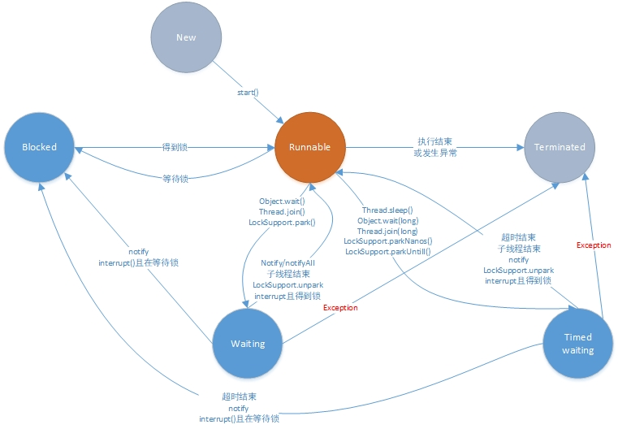

# Thread类和Runnable接口

上一章我们了解了多线程的基本概念。那么在Java中，我们是如何使用多线程的呢？

首先，我们需要有一个“线程”类。JDK提供了`Thread`类和`Runnalble`接口来让我们实现自己的“线程”类。

## 第一个Java多线程Demo

先学会怎么用，再学原理。首先我们来看看怎么用`Thread`和`Runnable`来写一个Java多线程程序。

```java
Thread threadA = new Thread(new Runnable() {
    @Override
    public void run() {
        System.out.println("threadA");
    }
});
threadA.start();

// Java 8 函数式编程
Thread threadB = new Thread(() -> System.out.print("threadB"));
threadB.start();
```

注意要调用用`start()`方法后，该线程才算启动！

我们自己写的多线程任务，是继承`Thread`类好，还是实现`Runnable`接口好？

当然是实现`Runnable`接口！！！因为Thread类相比于`Runnable`类是非常大的，里面有很多对象和方法用来支持Thread类强大的功能。而我们实际上写自己的一个多线程任务时，是不需要这些对象和方法的，线程当然是越轻量越好，所以实现`Runnable`接口才是首选。

## Runnable接口

首先我们来看一下`Runnable`接口(JDK 1.8 +)：

```java
@FunctionalInterface
public interface Runnable {
    public abstract void run();
}
```

可以看到`Runnable`是一个函数式接口，这意味着我们可以使用**Java 8的函数式编程**来简化代码。

## Thread类

`Thread`类是一个`Runnable`接口的实现类，首先我们来看看Thread类的源码。

### Thread类的构造方法

查看Thread类的构造方法，发现基本上是简单调用一个私有的`init`方法来实现初始化。我们来看看init方法的方法签名：

```java
// 片段1 - init方法
private void init(ThreadGroup g, Runnable target, String name,
                      long stackSize, AccessControlContext acc,
                      boolean inheritThreadLocals)

// 片段2 - 构造函数调用init方法
public Thread(Runnable target) {
    init(null, target, "Thread-" + nextThreadNum(), 0);
}

// 片段3 - 使用在init方法里初始化AccessControlContext类型的私有属性
this.inheritedAccessControlContext = 
    acc != null ? acc : AccessController.getContext();

// 片段4 - 两个对用于支持ThreadLocal的私有属性
ThreadLocal.ThreadLocalMap threadLocals = null;
ThreadLocal.ThreadLocalMap inheritableThreadLocals = null;

```

我们挨个来解释一下这些参数：

- g：线程组，标识这个线程是在哪个线程组下；
- target：指定要执行的任务；
- name：线程的名字，多个线程的名字是可以重复的。如果不指定名字，见片段2；
- acc：见片段3，用于初始化私有变量`inheritedAccessControlContext`。这个变量有点神奇。它是一个私有变量，但是在`Thread`类里只有`init`方法对它进行初始化，在`exit`方法把它设为`null`。其它没有任何地方使用它。一般我们是不会使用它的，那什么时候会使用到这个对象呢？可以参考这个stackoverflow的问题：[Restrict permissions to threads which execute third party software](https://stackoverflow.com/questions/13516766/restrict-permissions-to-threads-which-execute-third-party-software)。
- inheritThreadLocals：可继承的ThreadLocal，见片段4，Thread类里面有两个私有属性来支持ThreadLocal，我们会在后面的章节介绍ThreadLocal的概念。

实际情况下，我们大多是直接调用下面两个构造方法：

```java
Thread(Runnable target)
Thread(Runnable target, String name)
```

### Thread类的主要方法

上面我们介绍了Thread类的构造方法和start方法。接下来我们看一下Thread类的其它主要方法。

#### 优先级

线程是有优先级的。优先级高的线程，获得时间片的可能性比较大。这个是根据操作系统底层的算法来决定的。在Thread类中，定义了三个优先级常量：

```java
public final static int MIN_PRIORITY = 1;
public final static int NORM_PRIORITY = 5;
public final static int MAX_PRIORITY = 10;
```

Thread类提供了setPriority(int newPriority)方法，可以设置线程的优先级。在这个方法里，检查了传入的优先级不能小于1，也不能大于10。而且受当前线程组的约束，如果超过了线程组允许的最大优先级，会重新设置为线程组的最大优先级。

#### 线程状态

不同于上一章介绍到的线程在”操作系统里的状态“，Java里面也有一个线程的状态。Thread类里面有一个public的内部枚举类，用于标识线程的状态。其结构如下：

```java
public enum State {
    NEW,
    RUNNABLE,
    BLOCKED,
    WAITING,
    TIMED_WAITING,
    TERMINATED;
}
```

分别来解释一下不同的状态：

- New：这个线程没有被start()启动，或者说还根本不是一个真正意义上的线程，从本质上讲这只是创建了一个Java外壳，还没有真正的线程来运行。
- Runnable： 包括了操作系统线程状态中的Running和Ready，也就是处于此状态的线程可能正在运行，也可能正在等待系统资源，如等待CPU为它分配时间片，如等待网络IO读取数据。
- Blocked：在等一个“锁”。
- Waiting：无限期等待，需要被其它线程唤醒。
- Timed_Waiting：限期等待，无需等待其它线程唤醒，一定时间之后他们会由系统自动的唤醒。
- Terminated：结束状态，run()方法结束后会进入这种状态。这只是Java语言级别的一种状态，在操作系统内部可能已经注销了相应的线程，或者将它复用给其他需要使用线程的请求。

状态转换图：



下面分别介绍一下图中的一些主要的方法。

**Object类的wait方法**

xxx

**Object类的notify和notifyAll方法**

xxx

**Thread类的join方法**

xxx

**Thread类的interrupt方法**

xxx

**LockSupport简介**

xxx

**特殊的方法-Thread.yield()**

xxx

#### 守护线程

#### 

# 参考文章

1. [Java语言定义的线程状态分析](https://www.cnblogs.com/trust-freedom/p/6606594.html)

